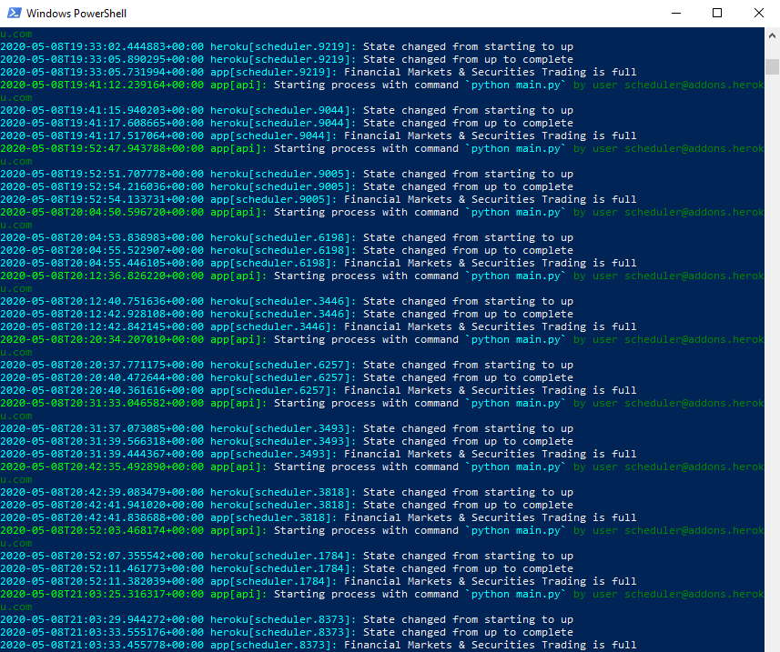

# Laurier Course Bot

Notifies you when a course at Laurier is open!

I have it set up to send a notification email using the free Mailgun API, but of course this can be modified.

I have designed it to be "stateless", so it could be scheduled to run on a free Heroku server every 10 mins.
A Postgres database is used to store courses which have already had a notification sent, so duplicate notifications are not received.

This can of course be changed, and a database would not be needed at all, by running the program on a dedicated machine and having it loop internally at a set interval instead.

## How to Run

Simply navigate into the directory and run `pip install -r requirements.txt`. Then run the program in Python3 by running `python main.py`.

## Demo 

See below for a sample output log of the program scheduled on a free Heroku server.

